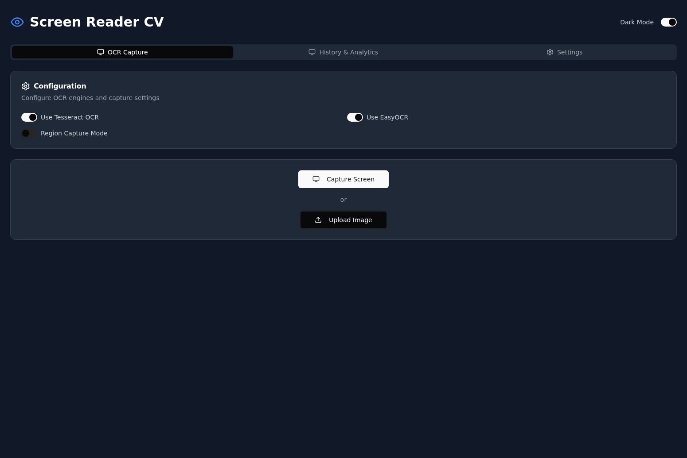
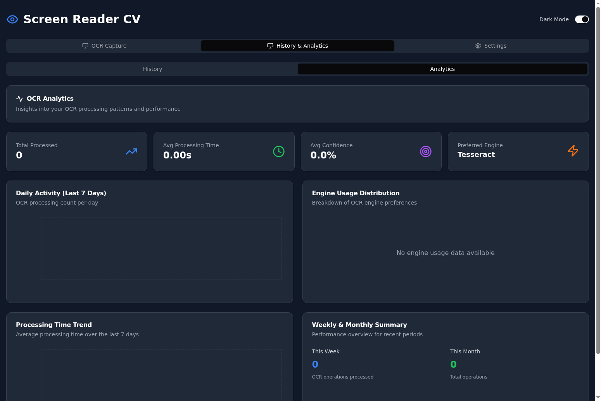
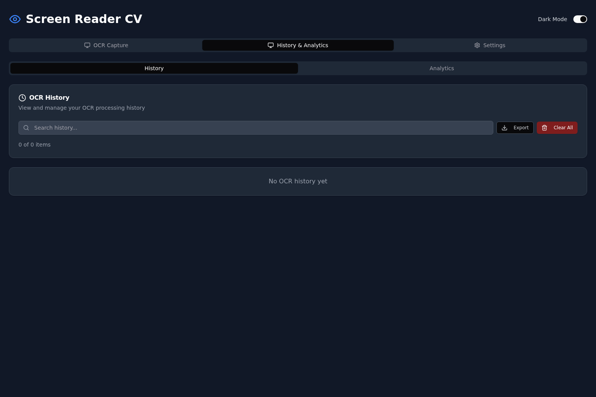
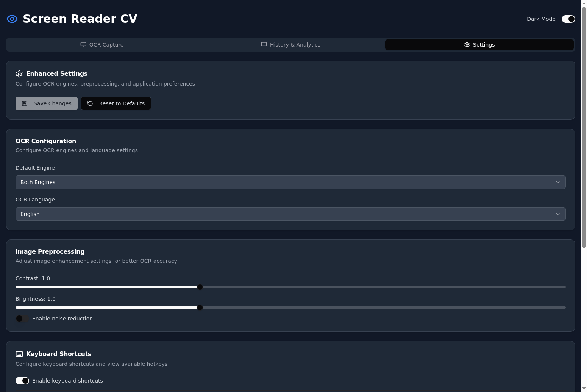

# 🖥️ Screen Reading Computer Vision Model

> 🚀 **A comprehensive computer vision solution for intelligent screen content analysis and text extraction**



[](https://screenreader-backend.onrender.com)
[](https://python.org)
[](https://fastapi.tiangolo.com)
[](https://reactjs.org)

## 🎯 Overview

The Screen Reading Computer Vision Model is a sophisticated multi-component system that combines advanced OCR technologies with modern web interfaces to provide real-time screen content analysis. The project consists of three main components:

- **🐍 Core Python Library** - Advanced OCR engine with dual-engine support
- **⚡ FastAPI Backend** - RESTful API service for screen capture and analysis  
- **🎨 React Frontend** - Modern web interface with real-time results

## ✨ Key Features

### 🔍 Advanced OCR Capabilities
- **Dual-Engine Support**: Combines Tesseract OCR and EasyOCR for maximum accuracy
- **Real-time Processing**: Fast screen capture and text extraction
- **Region-Specific Analysis**: Capture full screen or specific regions
- **Confidence Scoring**: Reliability metrics for extracted text
- **Bounding Box Detection**: Precise text location mapping

### 🌐 Web Application
- **Modern React UI**: Responsive interface with dark/light mode and tab-based navigation
- **Live Configuration**: Real-time OCR engine switching and advanced settings
- **Visual Results**: Interactive bounding box visualization with confidence metrics
- **Analytics Dashboard**: Usage tracking, performance insights, and historical data
- **History Management**: Persistent storage with search, filtering, and export capabilities
- **API Integration**: Seamless backend communication with enhanced error handling

### 🚀 Deployment Ready
- **Docker Support**: Containerized deployment
- **Cloud Ready**: Render.com and Railway configuration included
- **Cross-Platform**: Linux, macOS, and Windows support

## 🎨 Enhanced Frontend Features

### 📊 Analytics Dashboard
- **Usage Statistics**: Track total processed items, average processing time, and confidence metrics
- **Visual Charts**: Daily activity trends, engine usage distribution, and processing time analysis
- **Performance Insights**: Weekly and monthly summaries with detailed breakdowns
- **Real-time Updates**: Analytics automatically update as OCR operations are performed



### 📝 History Tracking
- **Complete OCR History**: Persistent storage of all OCR operations with metadata
- **Advanced Search**: Filter history by text content, source type, and confidence level
- **Export Functionality**: Download history as JSON for backup or analysis
- **Detailed View**: View full OCR results including bounding boxes and processing details



### ⚙️ Enhanced Settings
- **OCR Configuration**: Default engine selection and language settings
- **Image Preprocessing**: Adjustable contrast, brightness, and noise reduction
- **Keyboard Shortcuts**: Configurable hotkeys for common actions (Ctrl+S for capture, Ctrl+U for upload)
- **Data Management**: Export/import settings with reset to defaults option



### 🎯 Tab-based Navigation
- **Clean Interface**: Organized sections for OCR Capture, History & Analytics, and Settings
- **Preserved Functionality**: All existing OCR capabilities maintained and enhanced
- **Dark Mode Support**: Consistent theming across all new components
- **Responsive Design**: Mobile-friendly layouts using Tailwind CSS


## 🚀 Railway Deployment

Deploy to Railway with one command:

```bash
# Install Railway CLI
npm install -g @railway/cli

# Login and deploy
railway login
railway init
railway up
```

See [Railway Deployment Guide](docs/RAILWAY_DEPLOYMENT.md) for detailed instructions.

### Quick Deploy Options

**Option 1: Monorepo (Recommended)**
- Deploy both frontend and backend from root directory
- Automatic service linking and environment configuration
- Uses root `railway.toml` configuration

**Option 2: Individual Services**
- Deploy backend: `cd web-app/screenreader-backend && railway up`
- Deploy frontend: `cd web-app/screenreader-frontend && railway up`

### Environment Variables
- **Backend**: `PORT`, `PYTHON_VERSION` (3.12)
- **Frontend**: `PORT`, `NODE_VERSION` (18), `VITE_API_URL`

## 🏗️ Architecture

```
┌─────────────────┐    ┌─────────────────┐    ┌─────────────────┐
│   React Frontend │    │  FastAPI Backend │    │ Core Python Lib │
│                 │    │                 │    │                 │
│ • UI Components │◄──►│ • REST API      │◄──►│ • Screen Capture │
│ • Configuration │    │ • CORS Enabled  │    │ • OCR Processing │
│ • Real-time UI  │    │ • Health Checks │    │ • Image Analysis │
└─────────────────┘    └─────────────────┘    └─────────────────┘
```

## 🚀 Quick Start

### Option 1: Core Library Only
```bash
# Clone the repository
git clone https://github.com/raimonvibe/screenreader-computer-vision.git
cd screenreader-computer-vision

# Install dependencies
pip install -r requirements.txt

# Run the demo
python demo.py
```

### Option 2: Full Web Application
```bash
# Start the backend
cd web-app/screenreader-backend
pip install -r requirements.txt
uvicorn app.main:app --reload

# Start the frontend (new terminal)
cd web-app/screenreader-frontend
npm install
npm run dev
```

### Option 3: Docker Deployment
```bash
# Backend
cd web-app/screenreader-backend
docker build -t screenreader-backend .
docker run -p 8000:8000 screenreader-backend

# Frontend
cd web-app/screenreader-frontend
npm run build
# Deploy dist/ folder to your preferred hosting service
```

## 💻 Core Library Usage

```python
from screen_reader import ScreenReader

# Initialize with both OCR engines (recommended)
reader = ScreenReader(use_easyocr=True, use_tesseract=True)

# Capture entire screen
result = reader.read_screen()
print(f"📝 Extracted text: {result['text']}")
print(f"🎯 Confidence: {result['confidence']:.2f}%")
print(f"📍 Found {len(result['bounding_boxes'])} text regions")

# Capture specific region
result = reader.read_region(x=100, y=100, width=500, height=300)

# Access detailed results
for i, box in enumerate(result['bounding_boxes']):
    print(f"Region {i+1}: '{box['text']}' at ({box['x']}, {box['y']})")
```

## 🛠️ Installation Options

### 📦 Standard Installation
```bash
pip install -r requirements.txt
```

### ⚡ Minimal Installation (Tesseract only)
```bash
pip install -r requirements_minimal.txt
```

### 🍎 macOS Installation
See detailed guide: [INSTALL_MACOS.md](INSTALL_MACOS.md)

## 🧪 Testing & Demo

```bash
# Run comprehensive tests
python test_screen_reader.py

# Interactive demo with multiple examples
python demo.py

# Test API endpoints
curl http://localhost:8000/api/health
```

## 📁 Project Structure

```
screenreader-computer-vision/
├── 📄 README.md                    # This file
├── 🐍 screen_reader.py             # Core OCR library
├── 🎮 demo.py                      # Interactive demo
├── 🧪 test_screen_reader.py        # Test suite
├── 📋 requirements.txt             # Python dependencies
├── 🍎 INSTALL_MACOS.md            # macOS setup guide
└── 🌐 web-app/                    # Web application
    ├── ⚡ screenreader-backend/    # FastAPI service
    │   ├── 📄 README.md           # Backend documentation
    │   ├── 🐳 Dockerfile          # Container config
    │   ├── ☁️ render.yaml         # Deployment config
    │   └── 📁 app/                # API application
    └── 🎨 screenreader-frontend/   # React application
        ├── 📄 README.md           # Frontend documentation
        ├── 📦 package.json        # Node dependencies
        └── 📁 src/                # React components
```

## 🔗 Component Documentation

- **[🐍 Core Library](README.md)** - This document
- **[⚡ Backend API](web-app/screenreader-backend/README.md)** - FastAPI service documentation
- **[🎨 Frontend UI](web-app/screenreader-frontend/README.md)** - React application guide

## 🌟 Live Demo

🔗 **[Try the Live Demo](https://screenreader-backend.onrender.com)** - Experience the full web application

The live demo showcases:
- Real-time screen text extraction
- Interactive OCR engine configuration
- Visual bounding box overlays
- Performance metrics and confidence scores

## 🤝 Contributing

1. Fork the repository
2. Create a feature branch (`git checkout -b feature/amazing-feature`)
3. Commit your changes (`git commit -m 'Add amazing feature'`)
4. Push to the branch (`git push origin feature/amazing-feature`)
5. Open a Pull Request

## 📄 License

This project is licensed under the MIT License - see the [LICENSE](LICENSE) file for details.

## 🙏 Acknowledgments

- **Tesseract OCR** - Google's open-source OCR engine
- **EasyOCR** - Advanced deep learning OCR library
- **OpenCV** - Computer vision and image processing
- **FastAPI** - Modern Python web framework
- **React** - User interface library

---

<div align="center">

**🚀 Built with ❤️ for the computer vision community**

[⭐ Star this repo](https://github.com/raimonvibe/screenreader-computer-vision) • [🐛 Report Bug](https://github.com/raimonvibe/screenreader-computer-vision/issues) • [💡 Request Feature](https://github.com/raimonvibe/screenreader-computer-vision/issues)

</div>
